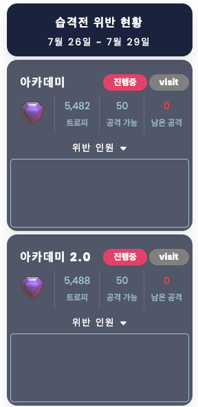

# 개요

> 클래시 오브 클랜 편의/운영 기능을 반응형 웹 서비스로 제공하는데 목적<br/>
> 
> 연동 API: [Clash of Clan API](https://developer.clashofclans.com/#/)<br/>
> 
> 참조 Resources<br/>
>   . [Clash of Clans Wiki](https://clashofclans.fandom.com/wiki/Clash_of_Clans_Wiki)<br/>
>   . [Clash of Clan 나무위키](https://namu.wiki/w/%ED%81%B4%EB%9E%98%EC%8B%9C%20%EC%98%A4%EB%B8%8C%20%ED%81%B4%EB%9E%9C)
>

# 개발환경
`Oracle Cloud Free tier 서버에서 운영중`
> 운영 환경 무료 서버 spec [CPU: 1Core, RAM: 1GB]<br/>
> 
> Spring Boot 3.2.4<br/>
> JDK 17<br/>
> H2 Database<br/>
> JPA + QueryDSL<br/>
> HTML, javascript, jQuery, CSS<br/>

# 개발자 코멘트
> 클린 아키텍처, 객체지향 설계를 고려한 개발 및 리팩토링 작업 병행중<br/>
> 
> 안정적인 서비스를 위해 COC API 연동을 최소화 전략 구성<br/>
> 일부 실시간 데이터가 반드시 필요한 경우 COC API 실연동 진행 외 별도 스케쥴링<br/>
> ex) 배정/리그 배정 클랜 이동 확인, 클랜전 현황, 리그전 현황 등..<br/>
> 
> 스케쥴링 정보<br/>
> 매 5분마다 클랜원 계정 갱신<br/>
> 매 1분마다 클랜전 기록 수집 및 종료 처리<br/>
> 
> API 와 VIEW Endpoint 분리 구성 -> 추 후 화면 소스를 Vue, React 등 전환 고려<br/>
> UI 구성을 위한 리소스 자원은 Pre-Load & caching 전략 수립<br/>
> 
> Swagger API 연동 규격 제공 예정 (운영 기능)

# 실행

## step 1.
```bash
gradle clean build -x test
```
## step 2.
```bash
java -jar -DCOC_API_KEY={COC_API_KEY} -DDB_USERNAME={DB_USERNAME} -DDB_PASSWORD={DB_PASSWORD} -DADMIN_ID={ADMIN_ID} -DADMIN_PASSWORD={ADMIN_PASSWORD} build/libs/clash-of-clan.jar
```
> COC_API_KEY: Clash of Clan API 연동 발급 키<br/>
> DB_USERNAME: database username<br/>
> DB_PASSWORD: database password<br/>
> ADMIN_ID: 운영 기능 로그인 아이디<br/>
> ADMIN_PASSWORD: 운영 기능 로그인 비밀번호

# 편의 기능 목록


## 기록
1. 명예의전당
	>개인 기록, 클랜전 기록, 리그전 기록, 습격전 기록 등을 제공

	
2. 유튜브 링크
	> 클랜 유튜브 이동
## 정보
1. 연구소
	> 클랜에서 제공하는 연구소 입장 링크 
2. 클랜 목록
	> 인게임에서 관리되는 클랜 목록 
	> . 컨텐츠 별 클랜 필터링 기능 제공 
	> . 현재 클랜원,배정클랜원 확인 기능
	> . 인게임 클랜 프로필 확인 기능
   
	
	
## 클랜원
1. 전체 클랜원
	> 클랜에서 관리되는 계정 목록
	> . 계정 이름, 태그, 현재 트로피, 지원 현황, 리그, 홀, 레벨, 영웅 레벨합, 영웅별 레벨, 영웅 장비, 배정 클랜, 리그 배정 클랜 확인 기능
	> . 계정 이름 필터링 기능
	> . 전체 클랜원 기준 트로피, 영웅 레벨합 순 정렬 기능

	
	
2. 클랜원 검색
   > 클랜에서 관리되는 계정 목록 중 검색 기능 제공
   > . 제공 기능은 전체 클랜원과 동일
3. 영웅 장비 현황
	> 클랜 별 영웅 장비 사용 통계 현황 기능
   
	
## 컨텐츠
1. 클랜전 현황
	> 클랜전 진행 결과 확인 기능
	> . 완파 홀, 획득 별, 사용 공격수, 평균 파괴량, 평균 완파 시간 확인 기능
	> . 클랜원 공격 현황 및 남은 공권 확인 기능
   
	
	
2. 습격전 현황
	> 현재 시즌 습격전 진행 현황 확인 기능
	> . 습격전 남은 공격 확인 기능
	> . 습격전 리그, 현재 트로피, 습격전 기록 확인 기능
	> . 전체, 미공, 미달 확인 기능

	
3. 리그전 현황
	> 리그전 진행 결과 확인 기능
	> . 기본 제공 기능은 클랜전 현황과 동일
	> . 리그전 리그 순위, 리그전 라운드 결과, 클랜원 기록 확인 기능
	> . 조 순위, 라운드 기록, 클랜원 기록, 클랜원 공격 현황 및 남은 공권 확인

	
	
	
	
4. 병행클랜전 현황
	> 클랜전 현황과 동일 

# 운영 기능

## 클랜 관리
1. 클랜원 관리
	> 클랜원 등록/삭제 기능
	> . 지원계정 설정 기능
	
	

2. 클랜 관리
	> 클랜 등록/삭제 기능
	> . 배정 클랜 일괄 등록 기능
	> . 배정 클랜 단건 등록/삭제 기능
	> . 리그 배정 일괄 등록 기능
	> . 리그 배정 단건 등록/삭제 기능
	> . 현재 클랜원 확인
	> . 클랜/리그 배정 클랜원 확인 및 인게임 가입 상태 확인

	
	
	
3. 전체 클랜원 엑셀 다운로드 기능
	> 클랜원 기본 정보 엑셀 파일 제공

## 컨텐츠 관리
### 클랜전 관리
1. 월 캘린더
	> 클랜전, 리그전, 병행 클랜전 진행 결과 확인
	
	
2. 월 완파 통계
	> 월별 클랜원 클랜전 진행 결과 통계 제공
	> . 엑셀 다운로드 기능 제공
	> . 클랜 별 필터링 기능 제공

	
3. 미공 캘린더
	> 클랜전 미공 클랜원 확인 기능
	> . 목록 선택 시 클립보드 복사 기능 제공

	
4. 미공 이력 조회
	> 클랜원 별 클랜전 미공 이력 조회 기능 제공

	
### 습격전 관리
1. 미공/미달 현황
	> 현재 시즌 미공 계정, 미달 계정 확인 기능
	> . 최근 습격전 기록 업데이트 기능 제공

	
2. 위반 현황
	> 지난주 특정 점수 이하 기록 후 특정 클랜에서 진행한 클랜원 확인 기능

	
3. 기록 조회
	> 특정 클랜원 최근 4주간 습격전 기록 조회 기능
	> . 이름 및 태그 조회 가능

	